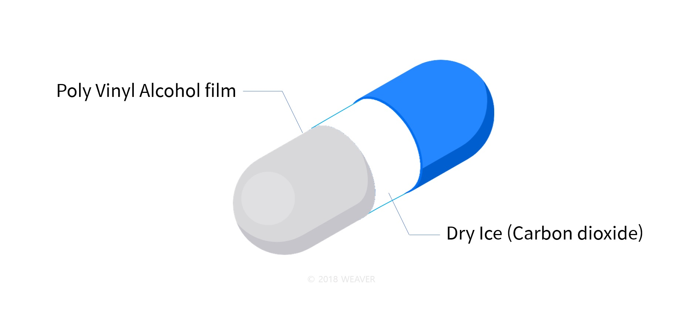
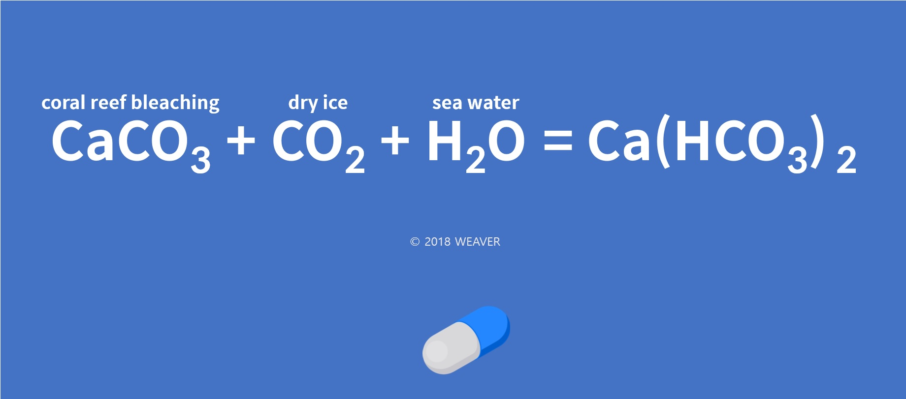
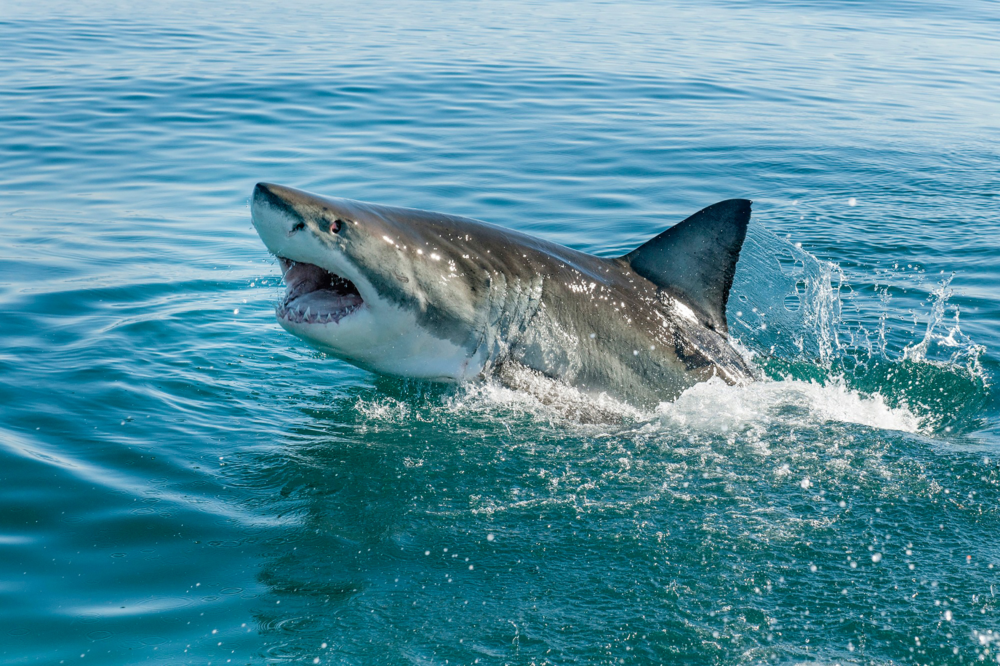

## Weaver-Version 2.

#### Before making, we found weakness of our first robot ( weaver-version.1)

+ speed is slow (Our robot uses wave to move.)
+ Our robot has a problem of turning (Because of its shape)
+ cannot collet lots of trash (Because of its shape)
+ The robot is poorly constructed 
+ Use servo motors a lot inefficiently (six Dynamixel servomotors)

#### To solve this problem, changed a lot of things

+ use three brushless motors to control direction -> use two brushless motors to move
+ use six servo motors to collect trash -> don't use servo motors to collect trash
+ get gps signal by using gps sensor -> get gps signal by using raspberry pi 3b+ (python_gpspy)
+ raspi_cam streaming via web
+ use two dynamixel motors to control direction of camera
+ use controller to control robot

#### Main technology

- Suppressing Coral Reef Bleaching 
- Cleaning floating garbage on the ocean 

#### capsule

weaver use capsule to supress Coral Reef Bleaching

Using this formula, we created a capsule to solve the problem of coral reef bleaching

#### How to collect trash

weaver has a big hole to collect trash in its body.  

It came from the shape of a shark. 

